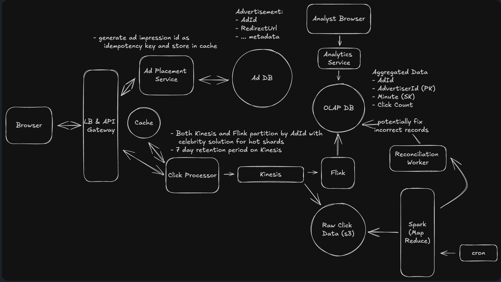

# Ad Click Aggregator System Design

## 1. Introduction & Problem Statement

### What is an Ad Click Aggregator?

An Ad Click Aggregator is a system designed to track, process, and aggregate clicks on advertisements in real-time. It serves as the analytics backbone for digital advertising platforms, enabling advertisers to monitor ad performance and make data-driven decisions.

### Use Case

Advertisers need to track the performance of their ads across various platforms. This includes:
- **Real-time metrics**: Understanding how many clicks their ads are receiving
- **Historical analysis**: Analyzing trends over time to optimize ad spend
- **Performance monitoring**: Tracking click-through rates (CTR) and engagement metrics
- **Fraud detection**: Identifying and filtering invalid or fraudulent clicks

The system must handle massive scale while maintaining accuracy and providing low-latency access to aggregated data.

## 2. Requirements

### Functional Requirements

1. **Click Tracking**: Capture every ad click with relevant metadata (ad ID, user ID, timestamp, etc.)
2. **Real-time Aggregation**: Aggregate clicks by various dimensions (ad, advertiser, time period)
3. **Analytics Queries**: Support fast queries for advertisers to view their ad performance
4. **Historical Data**: Store and provide access to historical click data
5. **Data Accuracy**: Ensure click counts are accurate and consistent

### Non-Functional Requirements

1. **Fault Tolerance**: System should continue operating despite component failures
2. **High Availability**: 99.99% uptime for critical path components
3. **Accuracy**: Click counting must be accurate with eventual consistency guarantees
4. **Real-time Processing**: Sub-second latency for click ingestion
5. **Idempotency**: Handle duplicate click events without double-counting
6. **Scalability**: Scale horizontally to handle traffic spikes
7. **Cost Efficiency**: Optimize storage and compute costs at scale

### Scale Requirements

- **Active Ads**: 10 million concurrent active advertisements
- **Peak Traffic**: 10,000 clicks per second
- **Daily Volume**: ~100 million clicks per day
- **Query Load**: Support thousands of concurrent analytics queries
- **Data Retention**: Store raw click data for compliance and reconciliation

## 3. Architecture Diagram



The architecture follows a lambda architecture pattern, combining real-time stream processing with batch processing for reconciliation.

## 4. Core Components

### Browser (Client)
- **Role**: User's web browser that displays ads and initiates click events
- **Responsibilities**:
  - Display ads served by the Ad Placement Service
  - Generate click events when users interact with ads
  - Send click requests to the API Gateway

### Load Balancer & API Gateway
- **Role**: Entry point for all incoming traffic
- **Responsibilities**:
  - Distribute traffic across multiple API Gateway instances
  - SSL termination
  - Rate limiting and DDoS protection
  - Request routing to appropriate backend services

### Ad Placement Service + Ad Database
- **Role**: Serves ads to users and manages ad metadata
- **Responsibilities**:
  - Select appropriate ads based on context and targeting rules
  - Generate unique impression IDs for each ad view
  - Store impression IDs temporarily for idempotency validation
  - Maintain ad metadata (advertiser ID, campaign details, targeting criteria)
- **Database**: Relational database (PostgreSQL/MySQL) for ad metadata

### Cache (Redis/Memcached)
- **Role**: Fast lookup for impression ID validation
- **Responsibilities**:
  - Store impression IDs with TTL (Time To Live)
  - Enable fast idempotency checks (O(1) lookup)
  - Reduce load on the Ad Database
- **Data Structure**: Set or Hash with impression ID as key
- **TTL**: 24-48 hours to cover delayed click scenarios

### Click Processor
- **Role**: Initial processing and validation of click events
- **Responsibilities**:
  - Receive click events from API Gateway
  - Validate impression ID against cache (idempotency check)
  - Enrich click data with metadata from Ad DB
  - Publish validated clicks to Kafka topic
  - Return quick acknowledgment to client
- **Technology**: Stateless microservice (Node.js, Go, or Java)

### Apache Kafka (Message Queue)
- **Role**: Distributed message queue for click events
- **Responsibilities**:
  - Durable storage of click events in topics with configurable retention
  - Enable multiple consumers via consumer groups (Flink, S3 archival)
  - Partition clicks by Ad ID for ordered processing and parallel consumption
  - Handle traffic spikes with horizontal scalability
- **Configuration**:
  - Topic: `ad-clicks`
  - Partition key: Ad ID (or composite key for hot partition handling)
  - Retention: Configurable (e.g., 24-48 hours, or longer as needed)
  - Replication factor: 3 for production (fault tolerance)
- **Deployment Options**:
  - Self-managed Kafka cluster
  - AWS MSK (Managed Streaming for Apache Kafka)
  - Confluent Cloud

### Apache Flink (Stream Processing)
- **Role**: Real-time stream processing and aggregation
- **Responsibilities**:
  - Consume click events from Kafka
  - Perform real-time aggregations with windowing (1-minute windows)
  - Handle late-arriving events with watermarks
  - Write aggregated results to OLAP DB
  - Maintain in-memory state for aggregations
- **Windowing Strategy**: Tumbling windows of 1 minute
- **State Backend**: RocksDB for fault-tolerant state management

### OLAP Database (ClickHouse/Druid)
- **Role**: Store aggregated click data for fast queries
- **Responsibilities**:
  - Store pre-aggregated click counts by dimensions
  - Support fast analytical queries with sub-second latency
  - Handle high write throughput from Flink
  - Enable efficient time-series queries
- **Schema Design**:
  ```
  Table: ad_clicks_aggregated
  - ad_id (PK)
  - advertiser_id (PK)
  - minute_timestamp (SK - Sort Key)
  - click_count
  - unique_users (HyperLogLog for cardinality estimation)
  ```

### Raw Click Data Storage (S3)
- **Role**: Long-term storage of raw click events
- **Responsibilities**:
  - Archive all raw click events for compliance and reconciliation
  - Partition data by date for efficient batch processing
  - Serve as source of truth for reconciliation
- **Format**: Parquet or ORC for compression and columnar access
- **Partitioning**: `/year=YYYY/month=MM/day=DD/hour=HH/`

### Analytics Service
- **Role**: API layer for advertisers to query their ad performance
- **Responsibilities**:
  - Expose REST/GraphQL API for analytics queries
  - Query OLAP DB for aggregated metrics
  - Implement caching for frequently accessed data
  - Handle authentication and authorization
  - Apply rate limiting per advertiser

### Reconciliation Worker + Apache Spark
- **Role**: Batch processing for data accuracy and correction
- **Responsibilities**:
  - Run periodic jobs (hourly or daily) to reprocess raw data from S3
  - Compare batch-computed aggregates with real-time aggregates
  - Detect and correct discrepancies
  - Update OLAP DB with corrected values
  - Generate reconciliation reports
- **Technology**: Apache Spark for distributed MapReduce processing

## 5. Key Data Flows

### Ad Serving Flow
1. **User Request**: Browser requests a web page with ad slots
2. **Ad Selection**: Ad Placement Service selects appropriate ads based on targeting
3. **Impression ID Generation**: System generates unique impression ID for each ad view
4. **Cache Storage**: Impression ID stored in cache with TTL
5. **Ad Delivery**: Ad rendered in user's browser with impression ID embedded

### Click Tracking Flow
1. **Click Event**: User clicks on an ad in the browser
2. **API Request**: Browser sends click request to Load Balancer with impression ID
3. **Routing**: Load Balancer routes to API Gateway, then to Click Processor
4. **Idempotency Check**: Click Processor validates impression ID against cache
   - If impression ID not found or already used: reject as duplicate
   - If valid: mark as used in cache and proceed
5. **Event Publishing**: Click Processor publishes validated click to Kinesis
6. **Acknowledgment**: Quick response returned to browser
7. **Stream Processing**: Flink consumes click event from Kinesis
8. **Aggregation**: Flink aggregates clicks in 1-minute windows
9. **Storage**: Aggregated data written to OLAP DB
10. **Archival**: Raw click event archived to S3 for reconciliation

### Analytics Query Flow
1. **Query Request**: Advertiser requests metrics via Analytics Service API
2. **Cache Check**: Analytics Service checks if result is cached
3. **DB Query**: If not cached, query OLAP DB for aggregated metrics
4. **Result Processing**: Format and prepare response data
5. **Cache Update**: Store result in cache for future requests
6. **Response**: Return metrics to advertiser

### Reconciliation Flow
1. **Scheduled Job**: Spark job triggered on schedule (e.g., every hour)
2. **Data Loading**: Load raw click data from S3 for the reconciliation period
3. **MapReduce Processing**:
   - Map: Extract (ad_id, advertiser_id, minute_timestamp) from each click
   - Reduce: Aggregate clicks by dimensions
4. **Comparison**: Compare batch aggregates with OLAP DB values
5. **Correction**: If discrepancies found, update OLAP DB with corrected values
6. **Alerting**: Generate alerts if discrepancies exceed threshold
7. **Reporting**: Store reconciliation results for audit trail

## 6. Deep Dives

### Idempotency & Click Fraud Prevention

**Problem**: Network issues and malicious actors can cause duplicate click events, leading to inflated metrics and billing issues.

**Solution**: Impression ID as Idempotency Key

1. **Impression ID Generation**:
   - When an ad is displayed, generate a unique UUID (v4)
   - Format: `{ad_id}_{timestamp}_{random_uuid}`
   - Embed impression ID in ad click handler

2. **Idempotency Validation**:
   ```
   function processClick(impressionId, clickData):
       // Check if impression ID exists and is unused
       if cache.exists(impressionId) AND !cache.isUsed(impressionId):
           cache.markAsUsed(impressionId)
           publishToKinesis(clickData)
           return SUCCESS
       else:
           return DUPLICATE_REJECTED
   ```

3. **Cache Strategy**:
   - Store impression IDs in Redis with TTL (24-48 hours)
   - Use atomic operations (SET NX) to prevent race conditions
   - Key: `impression:{impressionId}`, Value: `{used: false, timestamp: ...}`

4. **Additional Fraud Prevention**:
   - Rate limiting per IP address
   - Device fingerprinting
   - Bot detection via user agent analysis
   - Click pattern analysis (abnormal click velocity)

### Hot Shard Handling

**Problem**: Popular ads (e.g., Super Bowl commercials, celebrity endorsements) create hot shards in Kinesis when partitioned by Ad ID, leading to throughput bottlenecks.

**Solution**: Celebrity Problem Mitigation

1. **Detection**:
   - Monitor per-partition metrics in Kinesis
   - Alert when partition exceeds 80% of throughput limit (1 MB/sec or 1000 records/sec)

2. **Dynamic Repartitioning**:
   ```
   function getPartitionKey(adId, clickData):
       if isHotAd(adId):
           // Use composite key to distribute across multiple partitions
           return adId + "_" + hash(userId) % HOT_AD_PARTITION_COUNT
       else:
           return adId
   ```

3. **Hot Ad Registry**:
   - Maintain list of hot ads in Redis
   - Update based on real-time traffic metrics
   - Automatically promote/demote ads based on thresholds

4. **Flink Handling**:
   - Use `keyBy()` on original Ad ID for aggregation
   - Flink automatically handles the repartitioning
   - Aggregation remains correct despite multiple partitions per ad

### Stream Processing with Apache Flink

**Architecture**:

1. **Source**: Kinesis Consumer with checkpointing
2. **Windowing**: Tumbling windows of 1 minute
3. **Aggregation**: Count clicks per (ad_id, advertiser_id, minute)
4. **Sink**: Write to OLAP DB

**Key Configurations**:

```java
StreamExecutionEnvironment env = StreamExecutionEnvironment.getExecutionEnvironment();
env.enableCheckpointing(60000); // Checkpoint every 60 seconds

DataStream<ClickEvent> clicks = env
    .addSource(new FlinkKinesisConsumer<>(...))
    .assignTimestampsAndWatermarks(
        WatermarkStrategy
            .<ClickEvent>forBoundedOutOfOrderness(Duration.ofSeconds(30))
            .withTimestampAssigner((event, timestamp) -> event.getTimestamp())
    );

DataStream<AggregatedClicks> aggregated = clicks
    .keyBy(event -> new Tuple2<>(event.getAdId(), event.getAdvertiserId()))
    .window(TumblingEventTimeWindows.of(Time.minutes(1)))
    .aggregate(new ClickCountAggregator());

aggregated.addSink(new OLAPDatabaseSink());
```

**Handling Late Events**:
- Watermark strategy allows 30 seconds of out-of-order events
- Late events beyond watermark can be sent to side output
- Side output processed separately or ignored based on business requirements

**Fault Tolerance**:
- Checkpointing to S3 every 60 seconds
- Exactly-once semantics with Kinesis checkpoints
- Automatic recovery from latest checkpoint on failure

### Reconciliation with Spark

**Purpose**: Ensure data accuracy by reprocessing raw data in batch mode.

**MapReduce Job**:

```python
# Spark Job (pseudo-code)
def reconcile_clicks(date, hour):
    # Read raw clicks from S3
    raw_clicks = spark.read.parquet(f"s3://clicks/year={date.year}/month={date.month}/day={date.day}/hour={hour}")

    # Map: Extract key dimensions
    mapped = raw_clicks.map(lambda click: (
        (click.ad_id, click.advertiser_id, click.timestamp.truncate_to_minute()),
        1
    ))

    # Reduce: Aggregate counts
    batch_aggregates = mapped.reduceByKey(lambda a, b: a + b)

    # Load real-time aggregates from OLAP DB
    realtime_aggregates = load_from_olap(date, hour)

    # Compare and identify discrepancies
    discrepancies = compare(batch_aggregates, realtime_aggregates)

    # Update OLAP DB with corrections
    if discrepancies:
        update_olap_db(discrepancies)
        alert_on_discrepancies(discrepancies)

    return discrepancies
```

**Reconciliation Schedule**:
- Run hourly for recent data (last 6 hours)
- Run daily for full day reconciliation
- Run weekly for broader consistency checks

**Handling Discrepancies**:
- Small discrepancies (<1%): Auto-correct and log
- Large discrepancies (>5%): Alert engineering team for investigation
- Update OLAP DB with batch-computed values as source of truth

### OLAP Database Schema Design

**Primary Table**: `ad_clicks_aggregated`

```sql
CREATE TABLE ad_clicks_aggregated (
    ad_id VARCHAR(64),
    advertiser_id VARCHAR(64),
    minute_timestamp TIMESTAMP,
    click_count BIGINT,
    unique_users BIGINT,  -- Using HyperLogLog for estimation
    PRIMARY KEY (ad_id, advertiser_id, minute_timestamp)
)
PARTITION BY RANGE (minute_timestamp)
ORDER BY (advertiser_id, ad_id, minute_timestamp);
```

**Why ClickHouse/Druid**:
- **Columnar Storage**: Efficient for aggregation queries
- **Compression**: Reduce storage costs for large datasets
- **Fast Queries**: Optimized for time-series analytical queries
- **High Write Throughput**: Handle continuous writes from Flink

**Partitioning Strategy**:
- Partition by time (daily or weekly partitions)
- Enable efficient data purging (drop old partitions)
- Improve query performance by partition pruning

**Indexing**:
- Primary key index on (ad_id, advertiser_id, minute_timestamp)
- Secondary index on advertiser_id for advertiser-scoped queries
- Materialized views for common aggregation patterns (hourly, daily rollups)

**Query Patterns**:
```sql
-- Get clicks for specific ad in last 24 hours
SELECT minute_timestamp, click_count
FROM ad_clicks_aggregated
WHERE ad_id = '12345'
  AND minute_timestamp >= NOW() - INTERVAL 24 HOUR
ORDER BY minute_timestamp;

-- Get total clicks per advertiser today
SELECT advertiser_id, SUM(click_count) as total_clicks
FROM ad_clicks_aggregated
WHERE minute_timestamp >= DATE_TRUNC('day', NOW())
GROUP BY advertiser_id;
```

## 7. Scalability Considerations

### Horizontal Scaling

1. **Stateless Services**:
   - Click Processor: Scale based on incoming traffic (auto-scaling group)
   - Analytics Service: Scale based on query load
   - Load balancers: Distribute across multiple availability zones

2. **Kinesis Sharding**:
   - Monitor throughput and add shards dynamically
   - Use UpdateShardCount API for elastic scaling
   - Each shard supports 1 MB/sec or 1000 records/sec

3. **Flink Parallelism**:
   - Increase task parallelism based on Kinesis shard count
   - Use task managers across multiple nodes
   - Scale compute resources based on processing lag

4. **OLAP Database**:
   - Shard by advertiser_id or date range
   - Replicate for read scaling
   - Use materialized views for pre-aggregated queries

### Data Optimization

1. **Compression**:
   - Use Snappy/LZ4 compression for Parquet files in S3
   - ClickHouse native compression for OLAP data
   - Reduce storage costs by 5-10x

2. **Data Retention**:
   - Raw clicks: 90 days in S3, then archive to Glacier
   - Minute-level aggregates: 30 days in OLAP DB
   - Hourly/daily rollups: 2 years in OLAP DB

3. **Caching**:
   - Cache frequent queries in Redis (Analytics Service)
   - CDN caching for static aggregation reports
   - TTL-based invalidation strategy

### Cost Optimization

1. **Reserved Capacity**:
   - Use reserved instances for baseline traffic
   - Spot instances for Spark reconciliation jobs

2. **Tiered Storage**:
   - Hot data (last 7 days): SSD-based OLAP storage
   - Warm data (30 days): Standard HDD storage
   - Cold data (90+ days): S3/Glacier

3. **Query Optimization**:
   - Pre-aggregate common queries (hourly/daily rollups)
   - Use materialized views to reduce compute costs
   - Implement query result caching

### Monitoring & Observability

1. **Metrics**:
   - Kinesis: IncomingRecords, IncomingBytes, WriteProvisionedThroughputExceeded
   - Flink: Checkpoint duration, processing lag, backpressure
   - OLAP DB: Query latency, disk usage, write throughput
   - Cache: Hit rate, eviction rate

2. **Alerting**:
   - Processing lag > 5 minutes
   - Reconciliation discrepancies > 5%
   - Cache hit rate < 80%
   - Error rate > 0.1%

3. **Distributed Tracing**:
   - Trace click events from browser to OLAP DB
   - Identify bottlenecks in processing pipeline
   - Debug data quality issues

---

## Summary

The Ad Click Aggregator system leverages a lambda architecture combining real-time stream processing (Flink) and batch processing (Spark) to achieve both low-latency analytics and high data accuracy. Key design decisions include:

- **Idempotency**: Using impression IDs prevents duplicate counting
- **Hot Shard Handling**: Dynamic partitioning prevents celebrity ad bottlenecks
- **Stream Processing**: Flink provides sub-second aggregation with fault tolerance
- **Reconciliation**: Spark ensures long-term data accuracy
- **OLAP Database**: ClickHouse enables fast analytical queries at scale

This architecture can handle 10,000 clicks/second with room to scale to 100,000+ by increasing Kinesis shards and Flink parallelism.
