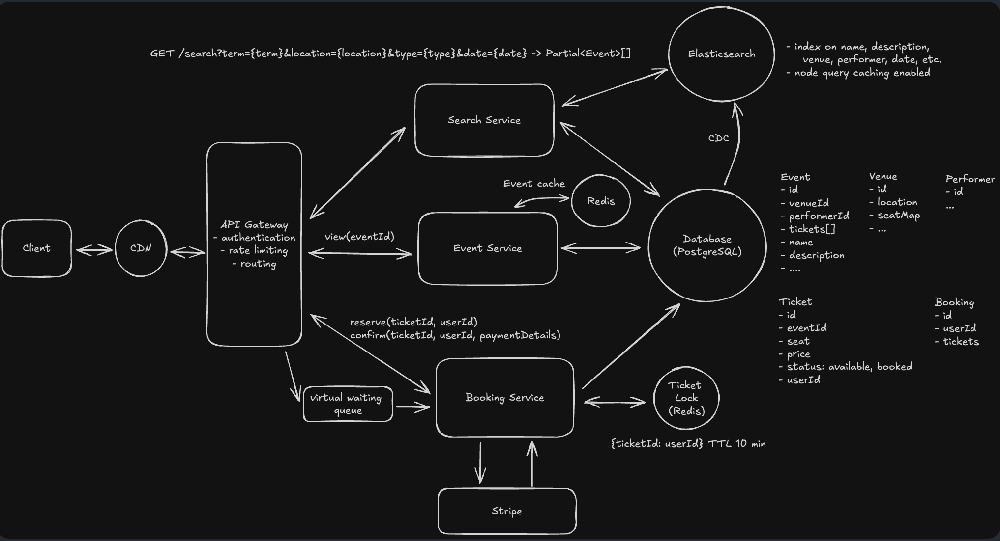

# Ticketmaster System Design Summary

> Source: [Hello Interview - Ticketmaster Problem Breakdown](https://www.hellointerview.com/learn/system-design/problem-breakdowns/ticketmaster)

---

## 1. Requirements Gathering

### Functional Requirements (Top 3)
- **Search for events** - Users can find events by date, location, performer, or genre
- **Reserve and purchase tickets** - Users select seats and complete transactions
- **View bookings** - Users can view their purchased tickets

### Non-Functional Requirements
- **High Availability** - System must be available especially during high-demand sales
- **Scalability** - Handle millions of concurrent users during popular events
- **Low Latency** - Fast responses, particularly for seat selection
- **Consistency** - No double-booking of the same seat

---

## 2. High-Level Architecture



```
Users → CDN → Load Balancer → API Gateway → Services
                                    ↓
                    ┌───────────────┼───────────────┐
                    ↓               ↓               ↓
              Search Service   Booking Service   Payment Service
                    ↓               ↓               ↓
              Elasticsearch    PostgreSQL         Stripe
                    ↑               ↑
                    └───CDC─────────┘
                           ↓
                        Redis (Distributed Locks)
```

### Key Components
| Component | Responsibility |
|-----------|----------------|
| **API Gateway** | Authentication, rate limiting, request routing |
| **Search Service** | Queries Elasticsearch for event discovery |
| **Booking Service** | Handles seat selection, locking, and reservation |
| **Payment Service** | Integrates with Stripe for transactions |

---

## 3. Database Design

| Database | Purpose |
|----------|---------|
| **PostgreSQL** | Primary data store for events, bookings, users (ACID transactions) |
| **Elasticsearch** | Full-text search for events (handles typos like "Tayler Swift" → "Taylor Swift") |
| **Redis** | Distributed locks, caching, rate limiting, waiting room positions |
| **Cassandra** | Optional - ticket availability for high-read scenarios |

### CDC (Change Data Capture)
- Uses **Debezium + Kafka** to sync PostgreSQL → Elasticsearch in real-time
- Keeps search results consistent with booking state
- Enables near-real-time updates without direct coupling

---

## 4. Preventing Double Booking (Critical Concept)

### Distributed Lock with Redis

**Flow:**
1. User selects a seat → Booking Service acquires lock in Redis with **10-minute TTL**
2. Lock key format: `seat:{event_id}:{seat_id}`
3. Booking record created with status `in_progress`
4. If payment succeeds → status becomes `sold`, lock released
5. If TTL expires → lock auto-releases, seat becomes available again

**Why Redis?**
- In-memory = low latency
- Atomic operations (SETNX)
- Built-in TTL support
- High throughput for concurrent requests

### Alternative Approaches
| Approach | Pros | Cons |
|----------|------|------|
| **Optimistic Concurrency Control (OCC)** | No lock overhead, version columns | Retries on conflict |
| **Row-level locking (PostgreSQL)** | Strong consistency | Can cause contention |
| **Unique constraints** | Simple, DB enforced | Limited flexibility |

---

## 5. Handling Popular Events ("Hot Events Problem")

This is the **hardest part** of the design and expected for senior-level candidates.

### Virtual Waiting Room

**Purpose:**
- Gates admission during high-demand sales
- Smooths traffic spikes
- Improves perceived fairness

**How it works:**
1. Users enter queue before sales start
2. System assigns queue position
3. Access tokens issued when user reaches front of queue
4. Token required to access booking flow

**Implementation:**
- Redis sorted sets for queue management
- WebSocket for real-time position updates
- Token-based admission control

### Scaling Strategies

| Strategy | What it Solves |
|----------|----------------|
| **CDN** | Cache static content (venue maps, event images) |
| **Read replicas** | Scale read operations on PostgreSQL |
| **Horizontal scaling** | Add more service instances behind load balancer |
| **Redis Lua scripts** | Atomic operations for GA ticket counters |
| **Connection pooling** | Reduce DB connection overhead |

---

## 6. Search Optimization

### Elasticsearch Configuration
- **Fuzzy matching** - Handles typos ("Tayler" → "Taylor")
- **Filters** - Date range, location, genre, price
- **Aggregations** - Faceted search results
- **Geo queries** - "Events near me"

### Indexing Strategy
```
Events Index:
- event_id
- title (analyzed)
- performer (analyzed)
- venue
- location (geo_point)
- date
- category
- price_range
```

---

## 7. Payment Flow

```
User → Booking Service → Create booking (status: pending)
                      → Acquire Redis lock
                      → Call Stripe API

Stripe → Webhook → Booking Service → Update status (sold/failed)
                                   → Release lock
                                   → Send confirmation
```

**Key Considerations:**
- Idempotency keys prevent duplicate charges
- Webhook verification for security
- Retry logic with exponential backoff
- Compensation transactions for failures

---

## 8. Key Technical Trade-offs

| Decision | Option A | Option B | Recommendation |
|----------|----------|----------|----------------|
| **Lock storage** | Redis (fast, volatile) | PostgreSQL (durable, slower) | Redis with fallback |
| **Lock TTL duration** | Short (5 min) - more availability | Long (15 min) - better UX | 10 minutes balanced |
| **Search sync** | Sync (consistent) | Async CDC (scalable) | CDC for scale |
| **Queue fairness** | FIFO strict | Lottery random | FIFO for transparency |

---

## 9. Failure Scenarios & Mitigations

| Failure | Impact | Mitigation |
|---------|--------|------------|
| Redis down | Can't acquire locks | Fallback to DB locks, circuit breaker |
| Payment timeout | User uncertain | Idempotency, status polling, email confirmation |
| ES out of sync | Stale search results | Health checks, manual reindex capability |
| DB overload | Booking failures | Connection pooling, read replicas, queue backpressure |

---

## 10. Interview Expectations by Level

| Level | Expected Depth |
|-------|----------------|
| **E4 (Mid)** | Basic architecture, requirements gathering, simple data model |
| **E5 (Senior)** | Distributed locks, search optimization, handling popular events |
| **E6+ (Staff)** | Deep trade-off analysis, failure scenarios, capacity planning, cost optimization |

---

## Quick Reference: Technologies Used

| Technology | Use Case |
|------------|----------|
| PostgreSQL | Primary OLTP database |
| Elasticsearch | Full-text event search |
| Redis | Distributed locks, caching, rate limiting |
| Kafka | Event streaming, CDC pipeline |
| Debezium | Change data capture from PostgreSQL |
| Stripe | Payment processing |
| CDN (CloudFront/Cloudflare) | Static asset caching, DDoS protection |

---

## Sources & Further Reading

- [Hello Interview - Ticketmaster Problem Breakdown](https://www.hellointerview.com/learn/system-design/problem-breakdowns/ticketmaster)
- [Hello Interview - Ticketmaster Answer Key](https://www.hellointerview.com/learn/system-design/answer-keys/ticketmaster)
- [Hello Interview - Elasticsearch Deep Dive](https://www.hellointerview.com/learn/system-design/deep-dives/elasticsearch)
- [Hello Interview - Redis Deep Dive](https://www.hellointerview.com/learn/system-design/deep-dives/redis)
- [Hello Interview - PostgreSQL Deep Dive](https://www.hellointerview.com/learn/system-design/deep-dives/postgres)
- [System Design School - Ticketmaster Guide](https://systemdesignschool.io/problems/ticketmaster/solution)
