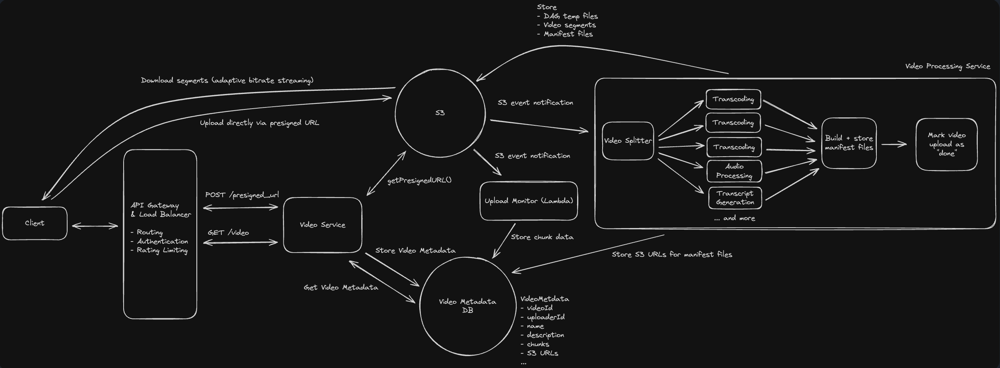

# YouTube System Design

This document outlines the architecture of a YouTube-like video streaming system, covering all major components, data flows, and key design decisions.

## Requirements Gathering

### Functional Requirements

- **Upload a video** — a user can upload a video file
- **Watch/stream a video** — a user can play a video with quality that adapts to their network conditions
- **Retrieve video metadata** — title, description, thumbnail, duration, and available resolutions are available without loading the video itself

### Non-Functional Requirements

- **Scalability** — handle a large number of uploads and views per day, independently
- **Low latency streaming** — CDN caching keeps playback start and segment fetches fast for popular content
- **High availability & durability** — an uploaded video must never be lost once accepted (S3 durability)
- **Loose coupling** — the upload and processing pipelines scale independently via event-driven processing (S3 → Lambda), rather than being tied together synchronously

## Architecture Diagram

The diagram above illustrates the complete architecture of the YouTube system, showing the relationships between all major components and the data flows for both video upload and streaming operations.

## Core Components

### Client Layer
- **Client**: The end user's device (web browser, mobile app) that uploads and watches videos

### Edge Layer
- **CDN (Content Delivery Network)**: Caches frequently accessed files close to users geographically. Serves video segments for streaming using adaptive bitrate streaming

### API Layer
- **API Gateway & Load Balancer**: Entry point for all API requests
  - Routing requests to appropriate services
  - Authentication
  - Rate limiting

### Application Layer
- **Video Service**: Core service handling video operations (upload initiation, metadata retrieval)
- **Video Metadata Cache**: Caches video metadata to reduce database load

### Storage Layer
- **S3**: Object storage for video files, segments, and manifest files
- **Video Metadata DB**: Stores video metadata (videoId, uploaderId, name, description, chunks, S3 URLs)

### Processing Layer (Video Processing Service)
- **Video Splitter**: Breaks uploaded video into smaller segments
- **Transcoding** (multiple workers): Converts video to multiple resolutions/bitrates (360p, 720p, 1080p, etc.)
- **Audio Processing**: Extracts and processes audio tracks
- **Transcript Generation**: Creates subtitles/captions
- **Build + Store Manifest Files**: Creates HLS/DASH manifest files for adaptive streaming
- **Upload Monitor (Lambda)**: Serverless function triggered by S3 events to orchestrate processing

## Key Data Flows

### Video Upload Flow
1. Client requests a presigned URL via `POST /presigned_url`
2. Video Service calls `getPresignedURL()` on S3
3. Client uploads video directly to S3 using the presigned URL (bypasses API servers for large files)
4. S3 triggers event notifications to Upload Monitor (Lambda)
5. Video Processing Service processes the video (split → transcode → build manifest)
6. Processed segments and manifests stored back to S3
7. S3 URLs stored in Video Metadata DB
8. Video marked as "upload done"

### Video Streaming Flow
1. Client requests video manifest/segments via `GET /video`
2. For frequently accessed content: served from CDN
3. For cache misses: CDN fetches from S3, then caches
4. Client downloads segments using adaptive bitrate streaming (quality adjusts based on network conditions)

## Key Design Decisions

1. **Presigned URLs**: Allows direct upload to S3, reducing load on application servers
2. **Event-driven processing**: S3 notifications trigger Lambda for loose coupling
3. **Parallel transcoding**: Multiple transcoding workers for different resolutions
4. **Adaptive bitrate streaming**: Manifest files + segments enable smooth playback across network conditions
5. **CDN caching**: Reduces latency and S3 costs for popular videos

## Video Metadata

Video metadata is structured information about each video that is stored separately from the actual video files. This metadata enables efficient video discovery, management, and serving without requiring access to the large video files themselves.

### Typical Metadata Fields

The Video Metadata DB stores essential information for each video:

- **videoId**: Unique identifier for the video
- **uploaderId**: User ID of the video uploader
- **name/title**: Display title of the video
- **description**: Text description and details
- **chunks**: Information about video segments (count, sizes)
- **S3 URLs**: References to video files, segments, and manifest files in object storage
- **status**: Processing state (uploading, processing, ready, failed)
- **duration**: Video length
- **thumbnailUrl**: Preview image location
- **timestamps**: Created, updated, published dates
- **view count**: Engagement metrics
- **resolutions**: Available quality levels (360p, 720p, 1080p, etc.)

### Why Store Metadata Separately?

1. **Performance**: Metadata queries are fast (KB) vs loading entire video files (GB)
2. **Cost efficiency**: Database queries are cheaper than S3 API calls and data transfer
3. **Search and filtering**: Enables efficient indexing and querying by title, uploader, date, etc.
4. **Caching**: Small metadata is easily cached in memory (Video Metadata Cache)
5. **Consistency**: Single source of truth for video state and properties

### Role in the Architecture

**Upload Flow**:
- Initial metadata record created when presigned URL is requested
- Updated with S3 URLs after processing completes
- Status field tracks progress (uploading → processing → ready)

**Streaming Flow**:
- Client queries metadata to get available resolutions and manifest URLs
- Video Metadata Cache serves frequently accessed metadata
- S3 URLs from metadata direct client/CDN to video segments

**Caching Strategy**:
- Popular video metadata cached in Video Metadata Cache
- Reduces database load for trending content
- Cache invalidation on metadata updates (title changes, new resolutions)

## Scalability Considerations

**How do we scale to a large number of videos uploaded/watched per day?**

The architecture addresses this through:
- **Horizontal scaling** of processing workers for parallel video processing
- **CDN distribution** to handle high read traffic globally
- **Event-driven architecture** allowing independent scaling of upload and processing pipelines
- **Object storage (S3)** that scales automatically with data growth
- **Caching layers** (CDN for videos, cache for metadata) to reduce database and storage load
- **Load balancing** across multiple API servers to distribute request traffic
